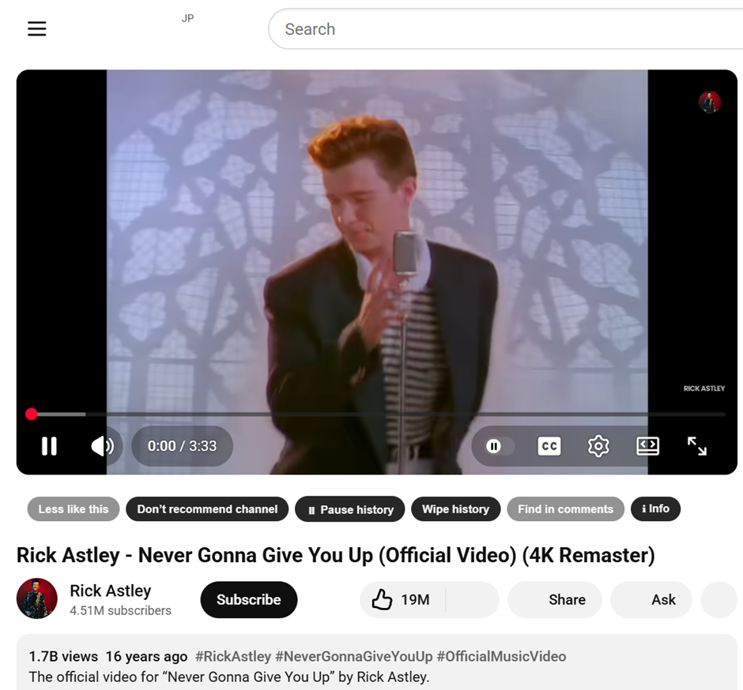
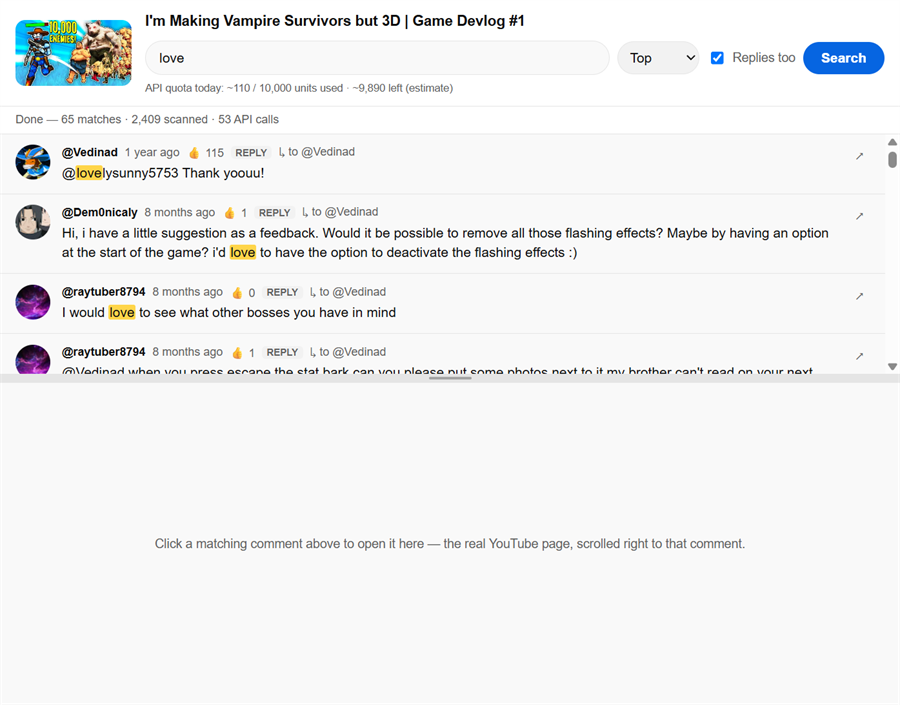
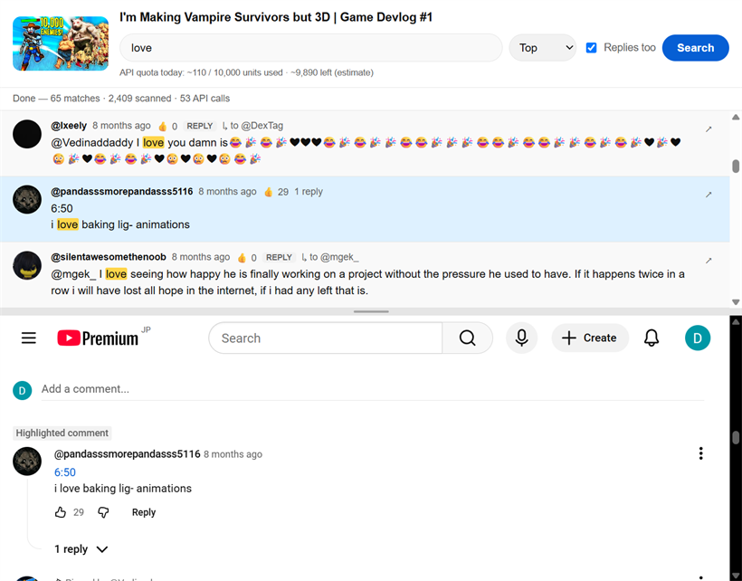

<div align="center">
  
  <h1>Seth's YouTube Fixer</h1>
  <p><b>Take back control of YouTube.</b> Tell it what you don't want, wipe what you just watched, and search every comment on a video, all from one small bar under the player.</p>
</div>

<p align="center">
  
</p>

A free Chrome and Brave extension. No accounts, no tracking, no servers. Everything happens in your own browser.

I doubt this will ever be on the Chrome Web Store, so if you want this, you'll have to install it as an "unpacked" extension. See below for instructions.

---

## What it does

### Less like this
One click sends YouTube's **real** "Not interested" signal for the video you're watching, so its recommendations actually learn. Click again to undo.

### Don't recommend channel
One click sends YouTube's **real** "Don't recommend channel" signal for the creator. Click again to undo.

> These aren't fake. The buttons reuse YouTube's own feedback actions. A button stays gray until YouTube has shown you that video or channel as a recommendation card, which is where the real action lives. Browse Home or the sidebar for a moment and it lights up.

### Wipe history
Delete the last 15, 30, 60, or 120 minutes (or a custom window) of YouTube watch and search history from your Google account. You get to **review the exact list before anything is deleted**.

### Pause history
Turn YouTube's watch-history recording on or off without digging through settings.

### Find in comments
Search **every** public comment and reply on a video, something YouTube itself won't let you do. Click a match and the **real YouTube page** opens right below it, scrolled to that comment, so you can Like or Reply normally.

<p align="center">
  
  &nbsp;
  
</p>

### Hide Shorts
A single toggle hides Shorts shelves, cards, and the sidebar link across YouTube.

---

## Install it (Chrome or Brave)

This extension isn't on the Chrome Web Store, so you install it as an "unpacked" extension. It takes about a minute and is completely standard.

1. **Get the extension folder.** Download the latest `seths-youtube-fixer-vX.X.X.zip` (or build it yourself, see [below](#build-it-yourself)) and **unzip it** to a folder you'll keep, for example `Documents\SethsYoutubeFixer`. Don't delete this folder later, because the browser loads from it.
2. Open your extensions page:
   - **Chrome:** go to `chrome://extensions`
   - **Brave:** go to `brave://extensions`
3. Turn on **Developer mode** (toggle in the top-right corner).
4. Click **Load unpacked** and select the unzipped folder.
5. Done. Click the puzzle-piece icon in the toolbar and **pin** "Seth's YouTube Fixer" so you can reach its settings easily.

Open any YouTube video and you'll see the new bar under the player.

> **Updating later:** download or build a new zip, unzip it over the same folder (replacing the files), then click the reload icon on the extension's card at `chrome://extensions`.

---

## Optional: turn on comment search

"Find in comments" needs a free **YouTube Data API key**. It's the only feature that does; everything else works with no setup. The key is your own, used only from your browser, on your own daily quota.

1. Click the extension's **Info** button (or open the toolbar icon and choose **Settings**).
2. Follow the step-by-step instructions there to create a free key. It takes about 3 minutes in the Google Cloud Console.
3. Paste the key in and **Save**. It's stored only on your computer and hidden by default. Click **Show** to check it.

Settings also show an **estimate of how much of your daily Google Youtube API quota you've used today**, and the search window keeps a running tally, so you can see how much headroom you have. You can set how many comments each search loads (default 50,000) there too.

---

## Privacy

- **Everything stays in your browser.** No analytics, no telemetry, no third-party servers.
- The extension stores, locally: captured feedback actions, video and channel IDs and titles, your API key, and a short-lived in-memory comment cache.
- It **never** stores your Google password, cookies, or session tokens.
- The only network calls are to **YouTube** (your own logged-in session, the same actions the site already offers) and **Google's API** (only for comment search, with your key).
- **Reset data for this extension** (in Settings) erases all of the above at any time.

See [PRIVACY.md](PRIVACY.md) for the full policy.

---

## Build it yourself

You need [Node.js](https://nodejs.org/) (18+).

```bash
npm install
```

**To produce an installable zip** (Windows): double-click **`build_release.bat`**. It builds the extension and writes `releases\seths-youtube-fixer-vX.X.X.zip`, ready to unzip and "Load unpacked", or to upload to the Chrome Web Store dashboard.

**Or build the folder manually:**

```bash
npm run build      # bundles src/ into dist/   (load dist/ as unpacked)
npm run watch      # rebuild on change
npm run typecheck  # tsc --noEmit
```

### Developing and testing

There's a CDP-based harness that drives the extension in a real, signed-in Chrome profile. Chrome blocks the `--load-extension` switch, so a dedicated dev profile is loaded once via the UI and reused.

```bash
npm run setup      # one-time: opens a dev profile at chrome://extensions to Load unpacked and sign in
npm run reload     # rebuild and hot-reload into the running Chrome
npm run drive      # rebuild, reload, and run a quick smoke test (injects the bar, screenshots)
npm test           # full Playwright suite
```

Architecture, design decisions, and status live in **[AGENTS.md](AGENTS.md)**.

---

<div align="center">
  by <b>Seth A. Robinson</b> · <a href="https://www.rtsoft.com">rtsoft.com</a>
</div>
